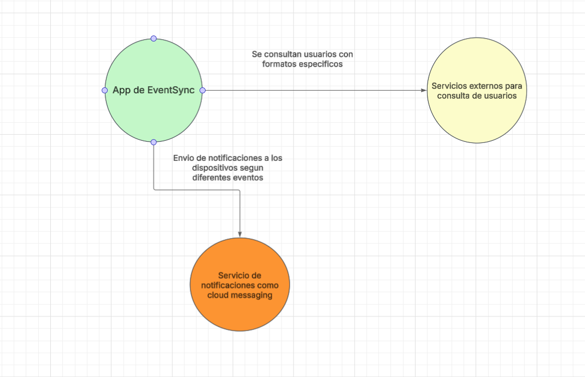

# Samuel Felipe Castelbanco Tellez

## EventSync

## Diagrama de contexto

## Requerimientos

### Requerimientos funcionales

El sistema de EventSync debe tener la capacidad de:

1. Creacion de eventos 
2. Notificaciones push al ocurrir alguno de estos eventos
3. Inscripcion de usuarios o asistentes

### Requerimientos no funcionales

El sistema de EventSync debe tener

1. Una paleta de colores oscura
2. La aplicacion debe soportar mas de 10.000 usuarios al mismo tiempo

## Patro de diseño

Para la creacion de eventos se decidio usar el patron Factory para poder manejar en una sola clase
la creacion de los difernetes eventos que pueden haber

