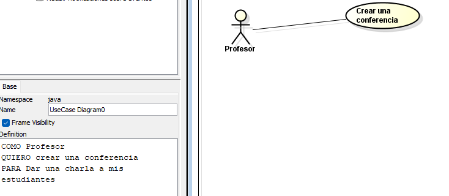
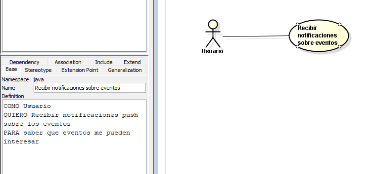
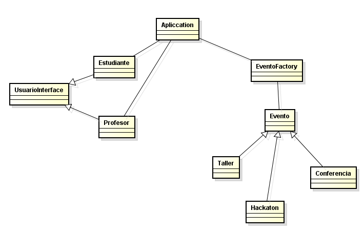

# Samuel Felipe Castelbanco Tellez

## EventSync

## Diagrama de contexto

## Requerimientos

### Requerimientos funcionales

El sistema de EventSync debe tener la capacidad de:

1. Creacion de eventos 
2. Notificaciones push al ocurrir alguno de estos eventos
3. Inscripcion de usuarios o asistentes

### Requerimiento Funcional 1

| Campo | Descripción |
|------|-------------|
| **ID** | RF-01 |
| **Nombre del requerimiento** | Creacion de eventos |
| **Descripción** | *El sistema debe poder permitir crear diferentes tipos de eventos con sus respectivas reglas.* |
| **Actor** | *Tanto estudiantes, profesores y administradores pueden crear eventos* |
| **Flujo principal** | 1. El actor diligencia formulario para la creacion del evento 2. El sistema verifica las reglas 3. El sistema crea el evento y notifica a los usuarios |
| **Diagrama de caso de uso** |  |
| **Patron** | *Factory* |

### 2.2 Requerimiento Funcional 2

| Campo | Descripción |
|------|-------------|
| **ID** | RF-02 |
| **Nombre del requerimiento** | Notificaciones push al ocurrir alguno de estos eventos |
| **Descripción** | *El sistema debe enviar notificaciones a los usuarios una vez creado un evento* |
| **Actor** | *Para este caso se usara firebase cloud messaging para el nevio de notificaciones* |
| **Flujo principal** | 1. Un usuario crea un evento. 2. Si fue exitoso la creacion. Se envia una notificaion a todos los usuarios|
| **Diagrama de caso de uso** | |

### Requerimientos no funcionales

El sistema de EventSync debe tener

1. Una paleta de colores oscura
2. La aplicacion debe soportar mas de 10.000 usuarios al mismo tiempo

## Patrones

Nombre del patron: Factory
Tipo de patron: Creacional
Decision: Para este caso se decidio utilizar el patron factory ya que nos facilita en un futuro la cracion
de eventos por medio de una superclase

Nombre del patron: Adapter
Tipo de patron: Estructural
Decision: Como el sistema debe interactuar con sistemas externos 
que entregan la información de los usuarios en formatos de texto diferentes se usa adapter para que sin importar el usuarios
se pueda registrar o crear eventos sin problema

## Epica

Creacion de eventos

## Historia de usuario

COMO Profesor
QUIERO crear una conferencia 
PARA Dar una charla a mis estudiantes

## Tareas

1. Creacion de interfaz para la creacion de eventos (formulario)
2. Validacion de datos
3. Creacion del endpoint para recibir datos del evento y crearlo

### Principio SOLID

Opend/Closed: En este desarrollo estamos usando el opend/closed ya que puede que exista en un futuro otro tipo de evento diferente
pero gracias a factory method esto no seria un problema.

## Diagrama de clases

